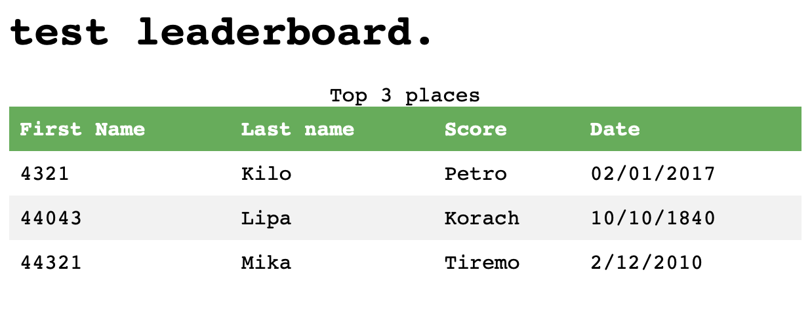

### Leaderboard


TODO:
1. API to getting result of contest
2. TCP server to consumption data and detecting IP addreses


## Preinstallation
- NodeJS ~10
- Redis


## Installation

1. `npm i`
||
`yarn`

## Run it

1. `npm watch` - data consumption
2. `npm start` - returns results of contest as HTML str

## Usage
1. POST data to TCP server. Template object:
```
{
  "member": 1212,
  "first_name": "Ignatiy",
  "last_name": "Trololo",
  "score": 1313,
  "date": "02/01/2017"
}
```

2. GET available data turning to HTTP server

## Result



## Contributing
Just me.
Pull requests are welcome :p

## License
[MIT](https://choosealicense.com/licenses/mit/)